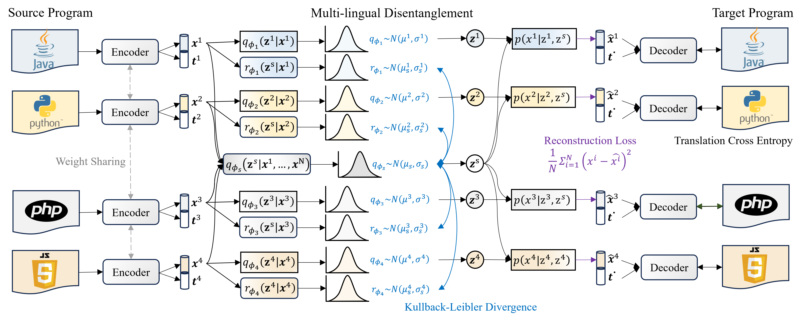

This repository provides the code and guidance for reproducing the results in our paper **"A Joint Learning Model with Variational Interaction for Multilingual Program Translation"**. In this paper, we argue that jointly learning a unified model to translate code across multiple programming languages is superior to separately learning from bilingual parallel data. We propose Variational Interaction for Multilingual Program Translation (VIM-PT), a disentanglement-based generative approach that jointly trains a unified model for multilingual program translation across multiple languages. VIM-PT disentangles code into language-shared and language-specific features using variational inference and interaction information with a novel lower bound. With the variational interaction, VIM-PT achieves significant improvement in multilingual program translation, mines and leverages the capability of non-parallel data, addresses the distribution shift of program semantics across languages, and serves as a unified model, reducing deployment complexity. 

## Requirements
* Conda
  * install conda: [https://conda.io/projects/conda/en/latest/user-guide/install/index.html](https://conda.io/projects/conda/en/latest/user-guide/install/index.html)
  * Create a new conda environment:
      * if you are running with GPU: 
        ```
        conda env create -f environment.yaml
        conda activate vimpt
        ```
        Dependencies include support for CUDA_12.4. If you are using a different CUDA version update the dependencies accordingly.

        
## Running the Artifact
        
* Evaluate and fine-tune the pre-trained model on the multilingual dataset with 7 languages.
```
python script.py
CUDA: input your cuda device ids
```
And the results will be saved into the csv, the weights will be saved too.
Please note that the runtime path should be correct, and you can change the corresponding file directory to your file address.
